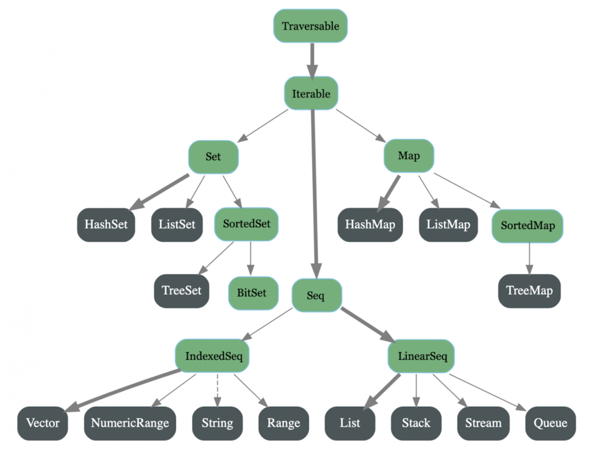

# Collections Hierachy

# [Lists](Lists.md)
# [Sets,Map,Tuples](Set_Map_Tuples.md)
# [Iterations][Iterations.md]

# Exercises
1. Create a list of the first 20 odd Long numbers. Can you create this with a for-loop, with the filter operation, and with the map operation? What’s the most efficient and      expressive way to write this?

2. Write a function titled “factors” that takes a number and returns a list of its factors, other than 1 and the number itself. For example, factors(15) should return 
   List(3, 5) .Then write a new function that applies “factors” to a list of numbers. Try using the list of Long numbers you generated in exercise 1. For example, executing      this function with List(9, 11, 13, 15) should return List(3, 3, 5), because the factor of 9 is 3 while the factors of 15 are 3 again and 5. Is this a good place to use   
   map and flatten? Or would a for-loop be a better fit?
    
3. Write a function, first[A](items: List[A], count: Int): List[A], that returns the first x number of items in a given list. For example, first(List('a','t','o'), 2) should
   return List('a','t'). You could make this a one-liner by invoking one of the built-in list operations that already performs this task, or (preferably) implement your own 
   solution. Can you do so with a for-loop? With foldLeft? With a recursive function that only accesses head and tail?
   
4. Write a function that takes a list of strings and returns the longest string in the list. Can you avoid using mutable variables here? This is an excellent candidate for      the list-folding operations (Table 6-5) we studied. Can you implement this with both fold and reduce? Would your function be more useful if it took a function parameter      that compared two strings and returned the preferred one? How about if this function was applicable to generic lists, i.e., lists of any type?

5. Write a function that reverses a list. Can you write this as a recursive function? This may be a good place for a match expression.

6. Write a function that takes a List[String] and returns a (List[String],List[String]), a tuple of string lists. The first list should be items in the original list that are
   palindromes (written the same forward and backward, like “racecar”). The second list in the tuple should be all of the remaining items from the original list. You can 
   implement this easily with partition, but are there other operations you could use instead?
